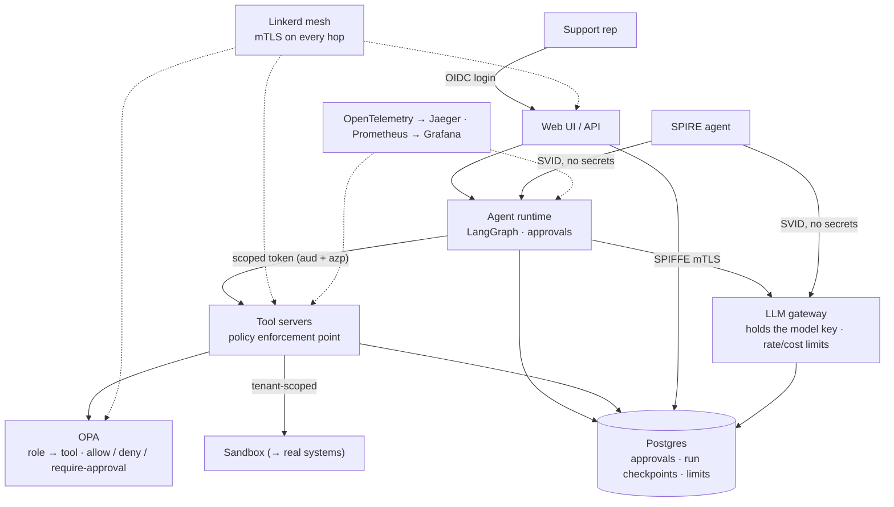

# agent-identity-platform

**A real-world platform for AI agents that have a cryptographic identity and act
under policy — instead of carrying API keys.**

This is the production-oriented companion to
[`enterprise-agent-nhi`](https://github.com/fkadusei/enterprise-agent-nhi), which
proves the core mechanics (SPIFFE workload identity, OAuth token exchange, OPA
policy) in a small runnable demo. This repository turns those mechanics into a
realistic application: a **customer-support & refunds copilot** where a support
rep delegates to an agent, high-risk actions require human approval, and every
action is identity- and policy-governed.

> **Status: complete.** Phases 1–3 are done, both gates are closed, and every
> threat in the [threat model](docs/threat-model.md) is addressed. The platform
> runs end to end on a 3-node Kubernetes cluster (kind): SPIFFE identity, OAuth
> delegation, policy, approvals, a service mesh, durable state, HA, autoscaling
> and a role → tool matrix. See [`HANDOFF.md`](HANDOFF.md) and
> [`docs/roadmap.md`](docs/roadmap.md).

## Why

Most agents today carry a static API key: it works from anywhere if leaked,
never expires on its own, and cannot say *which* agent did what. Because an agent
contains a model that can be talked into things, that is a breach waiting to
happen. This platform removes the key and replaces it with an identity.

## See it running

```sh
git clone git@github.com:fkadusei/agent-identity-platform.git
cd agent-identity-platform
./start.sh          # builds on first run (~10-15 min); resumes quickly after
```

Then open **http://localhost:8080** and sign in:

| user | password | role | can |
| --- | --- | --- | --- |
| `alice` | `alice123` | support_rep | everything but PII |
| `bella` | `bella123` | billing | orders + refunds only |
| `dana` | `dana1234` | read_only | reads only |
| `priya` | `priya123` | privacy | reads PII (with approval) + the basic reads |
| `manager` | `manager123` | manager | reads + refund quotes; approves |
| `admin` | `admin123` | platform_admin | administers users; no tools, no approvals |

Ask the console for *"Issue a refund of 200 dollars for order o-1001"* as alice:
it is held for approval. Approve it as the manager and it is issued. Ask for
$1000 and it is refused; ask as dana and it is refused with a clear reason.
`./status.sh` tells you if it is up; `./stop.sh` stops it.

Other ways in: the **Roles** tab shows the role → tool matrix (read from the
policy); [`docs/visualization/index.html`](docs/visualization/index.html) is an
interactive 3D architecture (double-click it, no server needed).

## Architecture



## Security invariants

Held everywhere — code, config, tests, logs, traces, prompts:

1. No secret is ever committed (`.env` is local and gitignored; `.env.example` is
   the template).
2. No secret or token in logs, traces, or errors.
3. **Synthetic data only** — never real customer, card, or personal data.
4. **No card data, ever** — the payments path handles only opaque tokens.
5. Identity over secrets; least privilege; no token forwarding.
6. Human approval for high-risk actions, with no self-approval.
7. Roles gate tools, on the server; the tenant comes from the identity, never the
   request.

See [`SECURITY.md`](SECURITY.md), [`docs/threat-model.md`](docs/threat-model.md),
and [`docs/data-handling.md`](docs/data-handling.md).

## Verify it

```sh
.venv/bin/python -m pytest -q           # app tests (118; 14 Postgres ones skip)
sdk/.venv/bin/python -m pytest sdk -q   # SDK (34)
opa test policy/                        # policy (31)

./scripts/demo.sh          # read → refund → approval → issued
./scripts/attack-tests.sh  # all six attacks blocked
./scripts/tenancy-tests.sh # tenant isolation, claim → policy → data
./scripts/role-tools.sh    # who may call which tool
./scripts/tls-check.sh     # every in-cluster edge is mTLS
./scripts/ha-check.sh      # replicas spread; an eviction is survivable
./scripts/scan-secrets.sh  # no secrets in the tree or the full history
```

## Documentation

| Audience | Start here |
|---|---|
| Everyone | [`docs/real-world-adoption.md`](docs/real-world-adoption.md) · [`docs/glossary.md`](docs/glossary.md) |
| Developers | [`CONTRIBUTING.md`](CONTRIBUTING.md) · [`docs/decisions/`](docs/decisions/) |
| Security | [`SECURITY.md`](SECURITY.md) · [`docs/threat-model.md`](docs/threat-model.md) · [`docs/roles-and-tools.md`](docs/roles-and-tools.md) · [`docs/tls.md`](docs/tls.md) |
| Data | [`docs/data-stores.md`](docs/data-stores.md) · [`docs/tenancy.md`](docs/tenancy.md) · [`docs/data-handling.md`](docs/data-handling.md) |
| Operators | [`docs/operator-guide.md`](docs/operator-guide.md) · [`docs/ha.md`](docs/ha.md) · [`docs/autoscaling.md`](docs/autoscaling.md) · [`docs/secrets.md`](docs/secrets.md) |
| Platform engineers | [`docs/ci-cd.md`](docs/ci-cd.md) · [`docs/llm-gateway.md`](docs/llm-gateway.md) · [`deploy/helm/agent-platform/`](deploy/helm/agent-platform/) |
| Resuming work | [`HANDOFF.md`](HANDOFF.md) · [`docs/roadmap.md`](docs/roadmap.md) · [`docs/backlog.md`](docs/backlog.md) |
| Users (plain language) | [`docs/guides/`](docs/guides/) |

## Repository layout

```
sdk/agentnhi/     reusable identity / delegation / policy / audit plumbing
app/agent         LangGraph agent with approval interrupts
app/api           FastAPI: login, enrollment, user admin, tasks, approvals, audit
app/web           React UI: console, approvals, roles, audit, admin
app/tools         policy enforcement point (HTTP + MCP transports)
app/gateway       the only egress to a model; SPIFFE mTLS; rate/cost limits
app/sandbox       synthetic systems exposed over HTTP (the tools' backend)
app/simulators    the simulated systems the tools act on (synthetic data)
app/approvals     the approvals store (in-memory | Postgres)
policy/           OPA: role → tool, allow / deny / require-approval + tests
deploy/kind/      local kind manifests
deploy/helm/      cloud-agnostic Helm chart
docs/             design, security, decisions, adoption, guides
scripts/          setup, demo, and the verification suites
```

## Contributing

Issues and pull requests are welcome — see [`CONTRIBUTING.md`](CONTRIBUTING.md).
Security problems: **do not** open a public issue; use GitHub's *Report a
vulnerability* ([`SECURITY.md`](SECURITY.md)).

## License

MIT — see [`LICENSE`](LICENSE).
