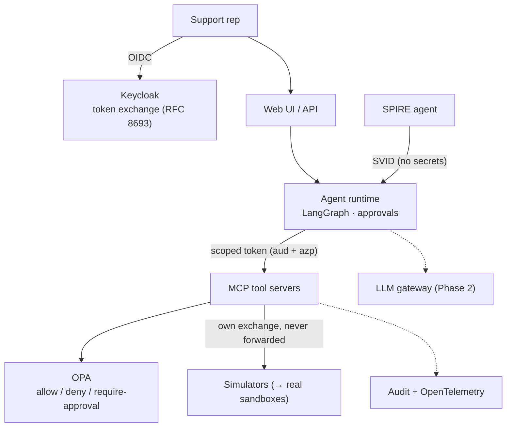

# agent-identity-platform

**A real-world platform for AI agents that have a cryptographic identity and act
under policy — instead of carrying API keys.**

This is the production-oriented companion to
[`enterprise-agent-nhi`](https://github.com/fkadusei/enterprise-agent-nhi), which
proves the core mechanics (SPIFFE workload identity, OAuth token exchange, OPA
policy) in a small runnable demo. This repository turns those mechanics into a
realistic application: a **customer-support & refunds copilot** where a support
rep delegates to an agent, high-risk actions require human approval, and every
action is identity- and policy-governed.

> **Status: Phase 0 — foundations, security, and documentation.**
> No application code yet by design; the security baseline and handoff come
> first. See [`docs/roadmap.md`](docs/roadmap.md) and
> [`HANDOFF.md`](HANDOFF.md).

## Why

Most agents today carry a static API key: it works from anywhere if leaked,
never expires on its own, and cannot say *which* agent did what. Because an agent
contains a model that can be talked into things, that is a breach waiting to
happen. This platform removes the key and replaces it with an identity.

## Architecture (target)



## See it in 3D

Open [`docs/visualization/index.html`](docs/visualization/index.html) in a
browser (double-click it — no server needed): orbit the layers, press
**▶ Play flow** to walk the eight hops, click any component for its role, and
toggle **⚠ Defences** to watch five attacks get blocked. Includes a
light/dark/auto theme toggle.

## Security invariants

Held everywhere — code, config, tests, logs, traces, prompts:

1. No secret is ever committed (`.env` is local; `.env.example` is the template).
2. No secret or token in logs, traces, or errors.
3. **Synthetic data only** — never real customer, card, or personal data.
4. **No card data, ever** — the payments path handles only opaque tokens.
5. Identity over secrets; least privilege; no token forwarding.
6. Human approval for high-risk actions, with no self-approval.

See [`SECURITY.md`](SECURITY.md), [`docs/threat-model.md`](docs/threat-model.md),
and [`docs/data-handling.md`](docs/data-handling.md).

## Getting started (Phase 0)

The application arrives in Phase 1. Today you can set up the security baseline
and read the design:

```sh
git clone git@github.com:fkadusei/agent-identity-platform.git
cd agent-identity-platform
./scripts/install-hooks.sh     # enable the secret-guard pre-commit hook
./scripts/scan-secrets.sh      # scan the tree + full history (needs gitleaks)
```

Then read, in order:

1. [`docs/real-world-adoption.md`](docs/real-world-adoption.md) — what this is and how to adopt it
2. [`docs/glossary.md`](docs/glossary.md) — every term in plain language
3. [`docs/threat-model.md`](docs/threat-model.md) — what it defends against
4. [`docs/decisions/`](docs/decisions/) — why each choice was made (ADRs)
5. [`HANDOFF.md`](HANDOFF.md) — where the build is and how to resume

## Documentation

| Audience | Start here |
|---|---|
| Everyone | [`docs/real-world-adoption.md`](docs/real-world-adoption.md) · [`docs/glossary.md`](docs/glossary.md) |
| Developers | [`CONTRIBUTING.md`](CONTRIBUTING.md) · [`docs/decisions/`](docs/decisions/) |
| Security | [`SECURITY.md`](SECURITY.md) · [`docs/threat-model.md`](docs/threat-model.md) · [`docs/data-handling.md`](docs/data-handling.md) |
| Resuming work | [`HANDOFF.md`](HANDOFF.md) · [`docs/roadmap.md`](docs/roadmap.md) |
| Operators | [`docs/operator-guide.md`](docs/operator-guide.md) · [`docs/secrets.md`](docs/secrets.md) · [`docs/policy-lifecycle.md`](docs/policy-lifecycle.md) |
| Users (plain language) | `docs/guides/` (added as features land) |

## Repository layout

```
sdk/agentnhi/     reusable identity/policy plumbing (Phase 1)
app/agent         LangGraph agent with approval interrupts (Phase 1)
app/api           FastAPI: sessions, tasks, approvals, audit (Phase 1)
app/web           React UI: console, approval queue, audit (Phase 1)
app/tools         MCP tool servers (Phase 1)
app/simulators    synthetic CRM / orders / payments / ticketing (Phase 1)
policy/           OPA allow / deny / require-approval + tests (Phase 1)
deploy/kind/      local kind manifests (Phase 1)
deploy/helm/      cloud-agnostic Helm chart (Phase 3)
infra/            SPIRE, Keycloak, OPA, gateway, observability
docs/             design, security, decisions, adoption, guides
```

## License

MIT — see [`LICENSE`](LICENSE).
